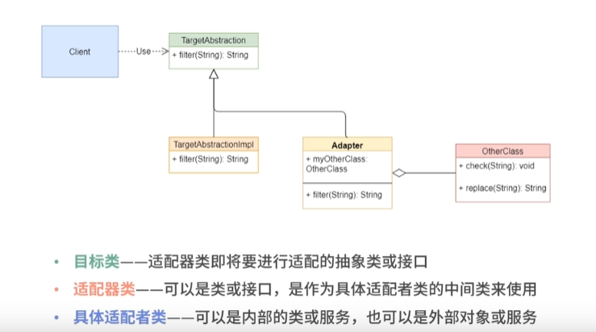
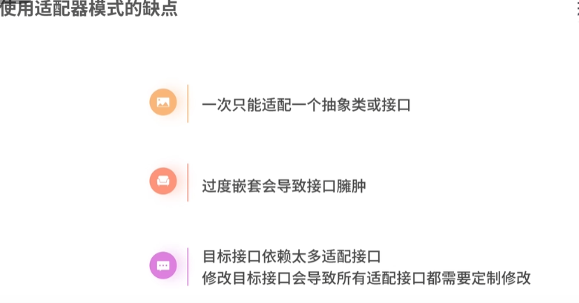

## 创建型——适配器模式

### 1. 适配器模式的定义
适配器模式(Adapter Pattern)：将一个类的接口转换成客户希望的另外一个接口，使得原本由于接口不兼容而不能一起工作的那些类可以一起工作。适配器模式又称为变压器模式，它是一种结构型设计模式。

### 2. 适配器模式的应用场景
适配器模式（Adapter Pattern）通常适用于以下场景。
场景一：已经存在的类的接口不符合我们的需求；
场景二：创建一个可以复用的类，使得该类可以与其他不相关的类或不可预见的类（即那些接口可能不一定兼容的类）协同工作；
场景三：在不对每一个都进行子类化以匹配它们的接口的情况下，使用一些已经存在的子类。
场景四：需要一个统一的输出接口，而输入端的类型不可预知。
场景五：需要将多个子类的公共行为提取出来并集中到一个公共父类中以避免代码重复。

### 3. 适配器模式的角色与职责
适配器模式的角色与职责如下。
- 目标抽象类角色：定义客户所需接口，可以是一个抽象类或接口，也可以是具体类。
- 适配器角色：通过包装一个需要适配的对象，把原接口转换成目标接口。
- 被适配者角色：被适配的类或对象，即将被包装的角色。
- 客户端角色：通过目标抽象类调用具体的目标类方法。

- 代码UML:
  

### 4. 适配器模式的优缺点
- 适配器模式的优点
  - 更好的复用性
  - 更好的扩展性
  - 更好的灵活性
- 适配器模式的缺点
  - 过多的使用适配器，会让系统非常零乱，不易整体进行把握。
  - 由于JAVA至多继承一个类，所以至多只能适配一个适配者类，而且目标类必须是抽象类。
  

### 5. 适配器模式的注意事项
- 适配器模式最好在详细设计阶段不要考虑它，它不是为了解决还处在开发阶段的问题，而是解决正在服役的项目问题。应该在有足够的使用测试后，对系统进行必要的重构时再考虑它。
- 注意适配器不是在详细设计时添加的，而是解决正在服役的项目的问题。

