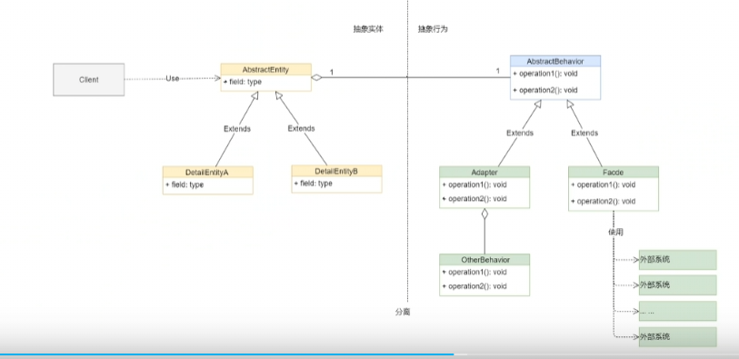

## 桥接模式
### 1. 介绍
桥接模式(Bridge Pattern)：将抽象部分与它的实现部分分离，使它们都可以独立地变化。桥接模式是一种结构型设计模式。
### 2. 桥接模式的应用场景
桥接模式（Bridge Pattern）通常适用于以下场景。
  - 场景一：如果一个系统需要在构件的抽象化角色和具体化角色之间增加更多的灵活性，避免在两个层次之间建立静态的联系。
  - 场景二：设计要求实现化角色的任何改变不应当影响客户端，或者实现化角色的任何改变对客户端是完全透明的。
  - 场景三：一个构件有多于一个的抽象化角色和实现化角色，系统需要它们之间进行动态耦合。
场景四：虽然一个系统需要在构件的抽象化角色和实现化角色之间建立一个固定的联系，但是又不希望在抽象化角色和实现化角色之间有一个静态的继承关系。
### 3. 桥接模式的角色与职责
桥接模式的角色与职责如下。
- 抽象化(Abstraction)角色：定义抽象类，并包含一个对实现化对象的引用。
- 扩展抽象化(Refined Abstraction)角色：是抽象化角色的子类，实现父类中的业务方法，同时通过组合关系调用实现化角色中的业务方法。
- 实现化(Implementor)角色：定义实现化角色的接口，供扩展抽象化角色调用。
- 具体实现化(Concrete Implementor)角色：给出实现化角色接口的具体实现。
  - 代码UML:
  
    