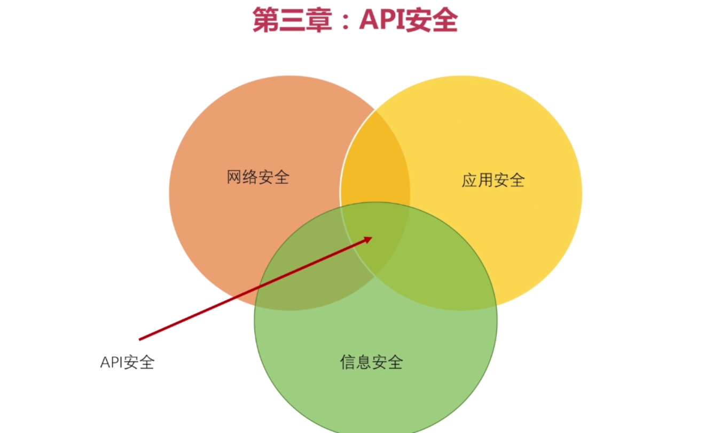
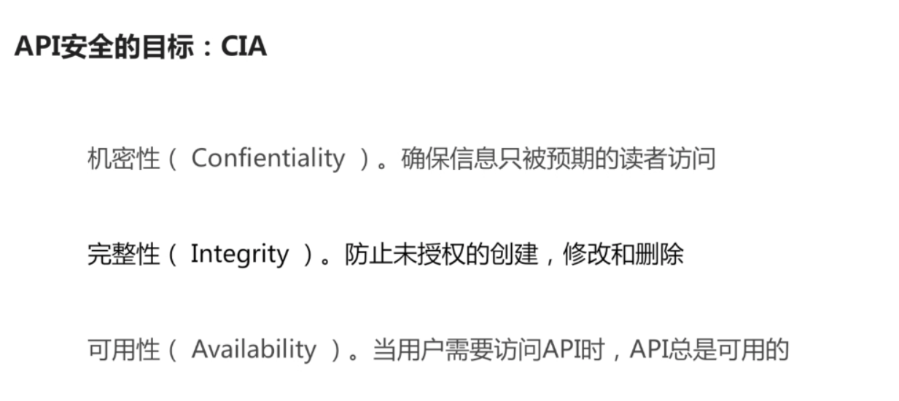
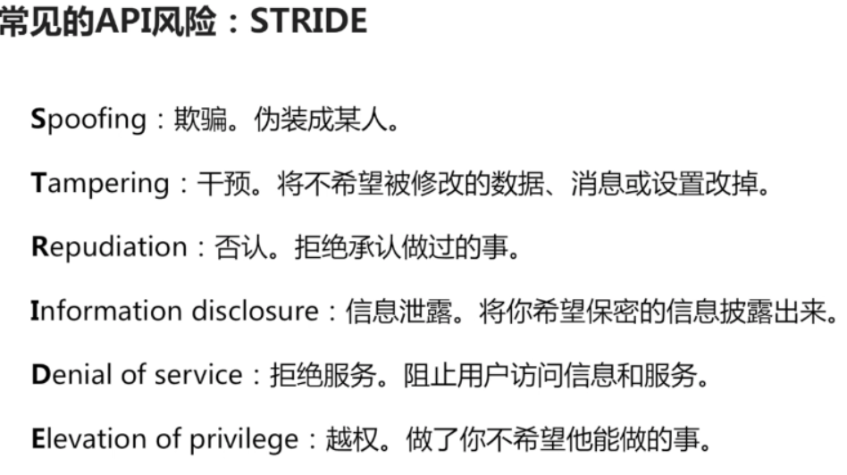
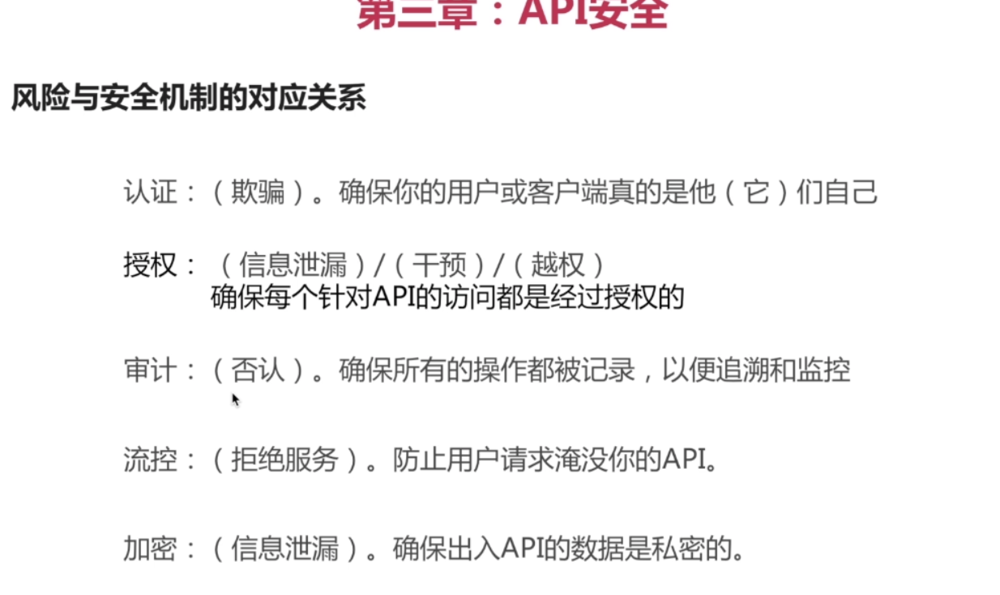
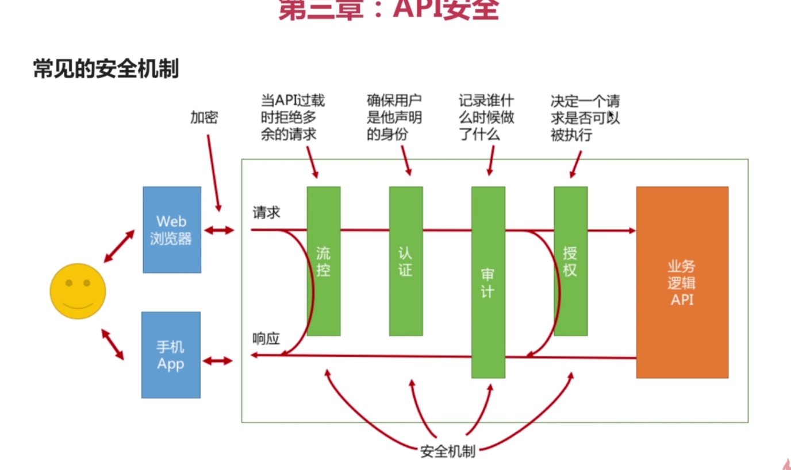
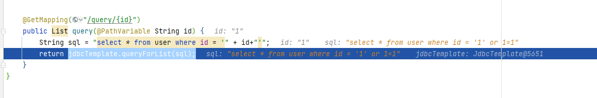

## api 信息安全





### 风险与安全机制：
- 风险

- 安全机制


sql 注入攻击：
- 
  - mybatis 如何解决sql注入问题

  $与#的区别：
    - #{}：表示一个占位符号，mybatis会将sql中的#{}替换为?号，然后调用PreparedStatement的set方法来赋值
    - ${}：表示一个拼接符号，mybatis会将sql中的${}替换为变量的值，这种方式存在sql注入的风险，不建议使用
--------------------------------------------------
- api 安全
 - 数据校验
 - 密码加密
   - https 访问 
   ```shell
      >keytool -genkeypair -alias ly  -keyalg RSA  -keystore E:\key\liuyao.key  
   ```