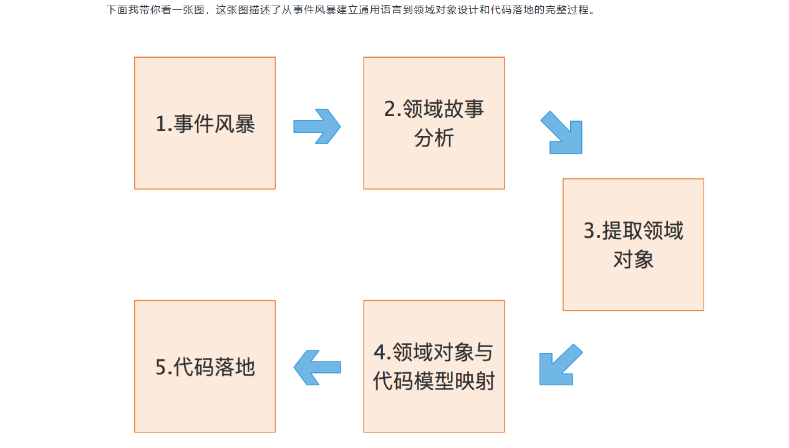
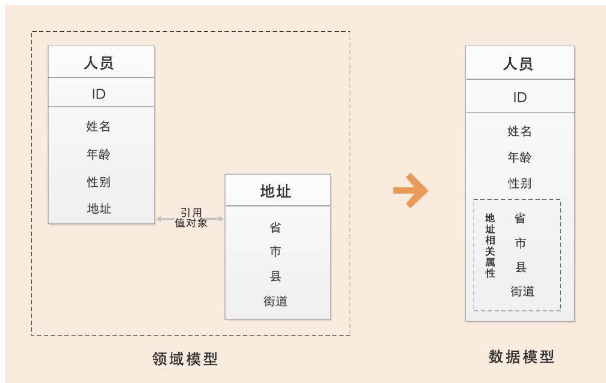
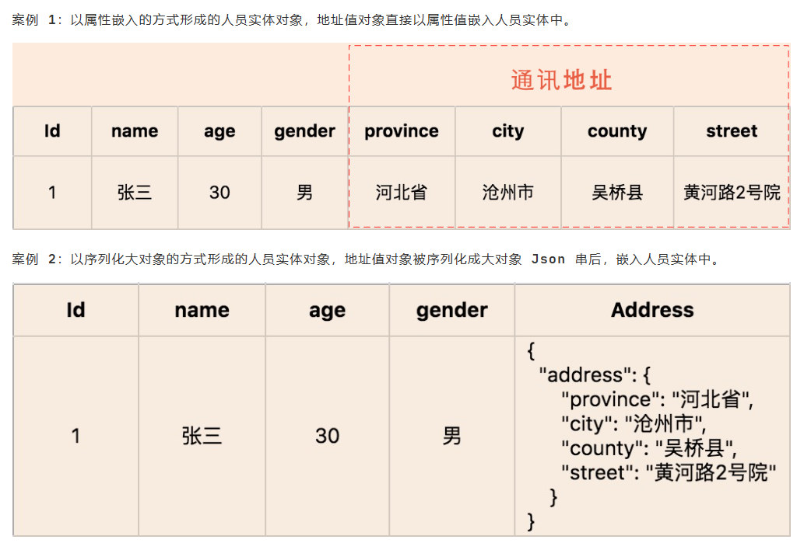
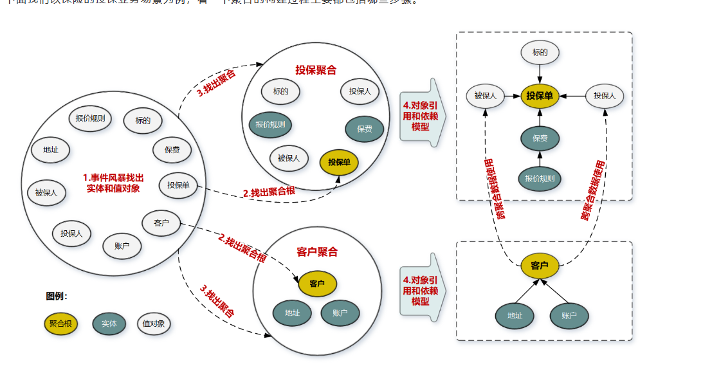
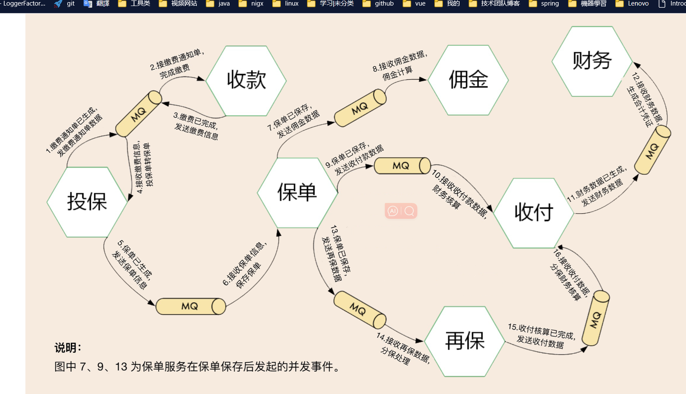
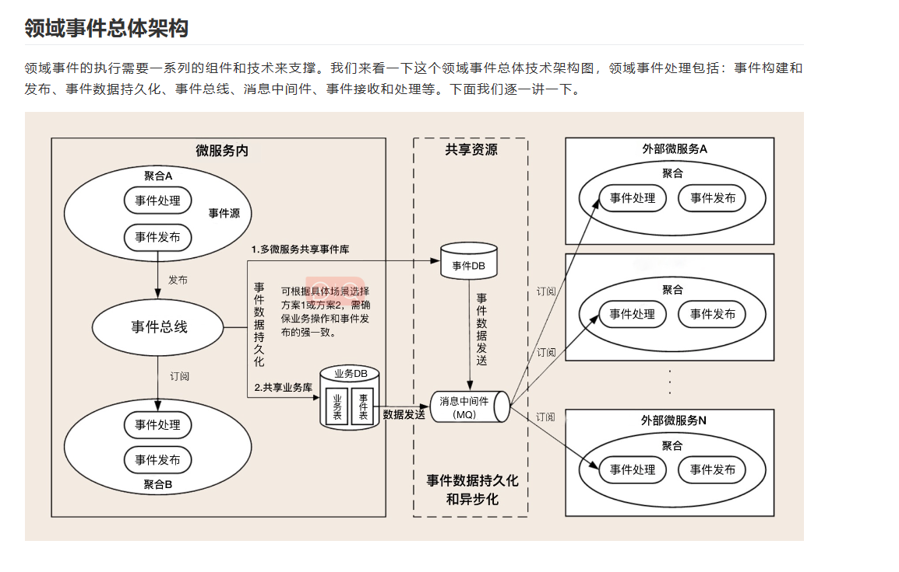
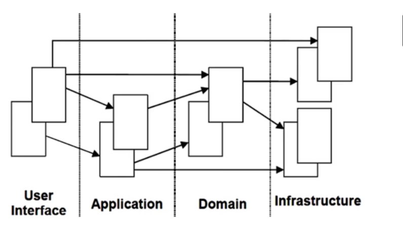

## DDD 实战课学习笔记 
### 通用语言和限界上下文
-----------------------------------------
    - 通用语言是领域专家和开发人员之间的桥梁
      - 在同一个领域的软件生命周期里都使用统一的语言进行交流
    - 限界上下文是通用语言的载体
      - 为了避免同样的概念或语义在不同的上下文环境中产生歧义

-----------------------------------------
### 实体和值对象
-----------------------------------------
  - 实体
    - 有唯一标识
    - 有生命周期
    - 有状态
  - 值对象
    - 没有唯一标识
    - 没有生命周期
    - 有状态
  - 
  - 
-----------------------------------------
### 聚合, 聚合根
-----------------------------------------

  - 聚合
    - 一组具有内聚关系的实体和值对象的集合
    - 聚合内部的对象可以直接访问, 聚合外部的对象只能通过聚合根访问
  - 聚合根
    - 聚合的根实体
    - 聚合根是聚合内部和外部的分界线
    - 聚合内部的对象可以直接访问, 聚合外部的对象只能通过聚合根访问
-----------------------------------------

**第 1 步：**采用事件风暴，根据业务行为，梳理出在投保过程中发生这些行为的所有的实体和值对象，比如投保单、标的、客户、被保人等等。

**第 2 步：**从众多实体中选出适合作为对象管理者的根实体，也就是聚合根。判断一个实体是否是聚合根，你可以结合以下场景分析：是否有独立的生命周期？是否有全局唯一 ID？是否可以创建或修改其它对象？是否有专门的模块来管这个实体。图中的聚合根分别是投保单和客户实体。

**第 3 步：**根据业务单一职责和高内聚原则，找出与聚合根关联的所有紧密依赖的实体和值对象。构建出 1 个包含聚合根（唯一）、多个实体和值对象的对象集合，这个集合就是聚合。在图中我们构建了客户和投保这两个聚合。

**第 4 步：**在聚合内根据聚合根、实体和值对象的依赖关系，画出对象的引用和依赖模型。这里我需要说明一下：投保人和被保人的数据，是通过关联客户 ID 从客户聚合中获取的，在投保聚合里它们是投保单的值对象，这些值对象的数据是客户的冗余数据，即使未来客户聚合的数据发生了变更，也不会影响投保单的值对象数据。从图中我们还可以看出实体之间的引用关系，比如在投保聚合里投保单聚合根引用了报价单实体，报价单实体则引用了报价规则子实体。

**第 5 步：**多个聚合根据业务语义和上下文一起划分到同一个限界上下文内。

-----------------------------------------
## 领域事件
------------------
  

